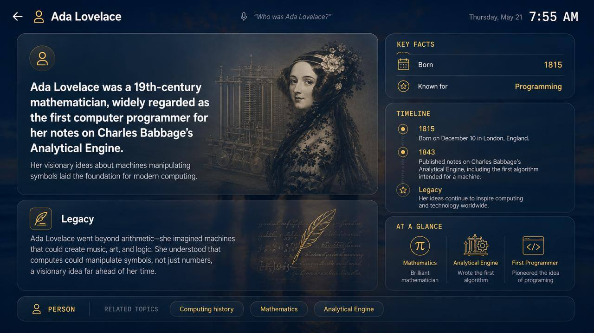

# Home Center

Open source family assistant that proactively turns on your TV using HDMI-CEC
and surfaces timely family needs that your OpenClaw can act upon. Full voice
interface with educational knowledge query support. Runs on Raspberry Pi with
mic.




## Features

- **Calendar** — daily, weekly, and full-month family views
- **Weather** — current conditions and forecast
- **Photos** — family photo slideshow
- **Timers** — voice-created kitchen and activity timers
- **Notifications** — email triage summaries and school updates
- **Birthdays** — upcoming family birthdays and gift reminders
- **Knowledge answers** — voice and dashboard Q&A with image-source safeguards
- **OpenClaw** — family Telegram assistant and dashboard enhancement layer
- **Design Claw** — daily design exploration and feedback capture

## Architecture

| Machine | Role |
|---------|------|
| **Raspberry Pi** (`homecenter.local`) | Chromium kiosk dashboard, HDMI-CEC, chime/timers, mic stream, and local command server |
| **Mac Mini** (`peters-mac-mini.lan`) | Production voice service, OpenClaw Telegram bridge, email triage, school updates, and Design Claw jobs |
| **Cloudflare Worker** | Authenticated API proxy, data aggregation, knowledge requests, and dashboard persistence |

Dashboard behavior follows the project-brain contract in
[`docs/README.md`](docs/README.md): raw data is normalized, derived state is
computed in one layer, and UI cards render from derived state rather than
making their own policy decisions.

## Voice Control

Production voice is split between the Pi and Mac Mini:

1. The Pi streams XVF3800 microphone audio to the Mac Mini and keeps serving
   local dashboard/CEC/timer/chime APIs.
2. The Mac Mini `voice-service` runs the production wake gate with
   **Vosk/Kaldi** (`WAKE_ENGINE=vosk`).
3. After a wake candidate, local **faster-whisper** transcribes the command.
4. `voice-service/intent.py` parses only dispatchable commands before the Pi
   chimes or performs an action.

`openWakeWord` remains available for measured `WAKE_ENGINE=openwakeword`
trials when an ignored local model artifact exists at
`pi/models/hey_homer.onnx`, but it is not the launchd default.

Supported command shapes include:

- **"Hey Homer, turn on"** — wake the TV
- **"Hey Homer, open calendar/weather/photos"** — navigate to a page
- **"Hey Homer, go back"** or **"Hey Homer, go home"** — return to dashboard
- **"Hey Homer, set a timer for 5 minutes"** — create a timer
- **"Hey Homer, ask/tell me/explain/describe ..."** — ask a knowledge question
- **"Hey Homer, turn off"** — put the TV in standby

Bare **"Hey Homer"** intentionally does nothing. Live reliability notes and
debugging order live in [`docs/wakeword.md`](docs/wakeword.md); the voice
command boundary is documented in [`docs/voice_commands.md`](docs/voice_commands.md).

## OpenClaw Routing

OpenClaw uses a conservative tiered route:

- Semantic cache first
- Local Ollama `gemma4:e4b` for local-classified requests
- Anthropic Sonnet (`claude-sonnet-4-6`) fallback for escalations, with Opus
  (`claude-opus-4-7`) available for hard or safety-sensitive escalation
- Groq remains in the codebase for explicit compare evals, but is dormant in
  the active route unless re-enabled by environment and eval data
- The future edge tier is documented as disabled until room-node Gemma E2B is
  ready

Knowledge responses use a separate JSON bridge: OpenAI knowledge model when
enabled, then local Gemma, then Anthropic Sonnet fallback. Visual-contract
checks guard known, diagram, generated, and no-image answers so they do not
regress into the wrong image shape.

## Gesture Control

Meta Ray-Ban glasses stream video to a HandController iOS app, which detects
hand gestures and sends them to the Pi. Wave to navigate between panels; pinch
to open or close fullscreen pages.

## Development

```bash
npm install
npm run dev        # http://localhost:5173
npm run build      # outputs to ./dist
npm test           # Vitest suite
npm run verify     # tests + knowledge checks + build
```

**Display target:** 1920x1080 logical, rendered at 2x on the 4K TV with
`--force-device-scale-factor=2`.

### Knowledge Checks

```bash
npm run check:knowledge-visual-contract
npm run check:knowledge-reference-fidelity
WORKER_TOKEN=<token> npm run check:knowledge-visual-contract:live
```

Run local mocked checks before deploys. Live mode validates production Worker
behavior and requires `WORKER_TOKEN`; do not print or commit secrets.

### Eval Harness

```bash
npm run eval:env
npm run eval:score
npm run eval:compare
npm run eval:report
```

Eval outputs are written under `openclaw/eval/results/`. The knowledge bridge
canaries and judge criteria live in `openclaw/eval/`.

## Deploying

Pi services are managed with systemd:

```bash
ssh pi@homecenter.local "sudo systemctl restart wake-word"
ssh pi@homecenter.local "sudo systemctl restart mic-streamer"
```

Mac Mini launchd templates and setup scripts live in
[`deploy/mac-mini/`](deploy/mac-mini/):

```bash
bash deploy/mac-mini/setup-openclaw-bridge.sh
bash deploy/mac-mini/setup-voice-service.sh
bash deploy/mac-mini/setup-voice-health.sh
```

## Contributing

Before touching state, cards, or data flow, read
[`docs/README.md`](docs/README.md). Meaningful behavior changes should update
the relevant docs and tests in the same PR.
