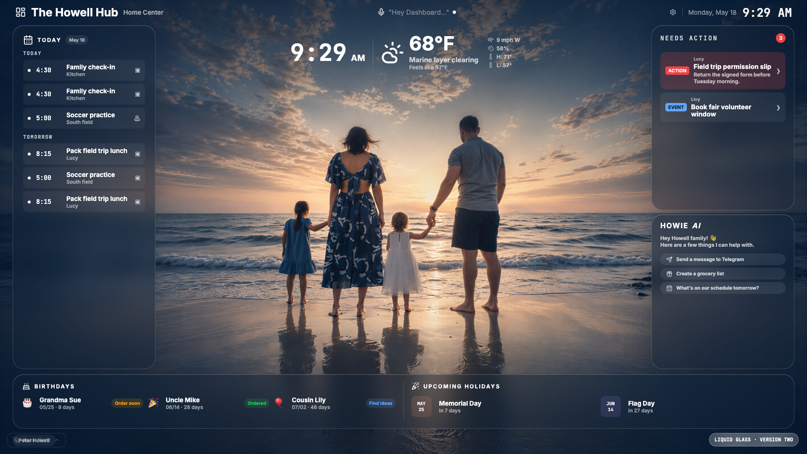
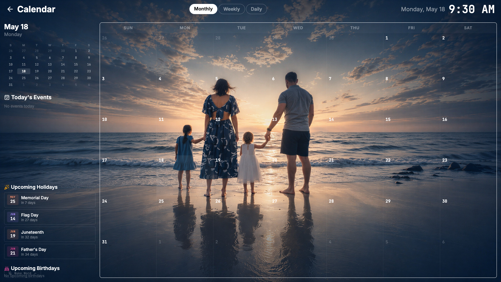
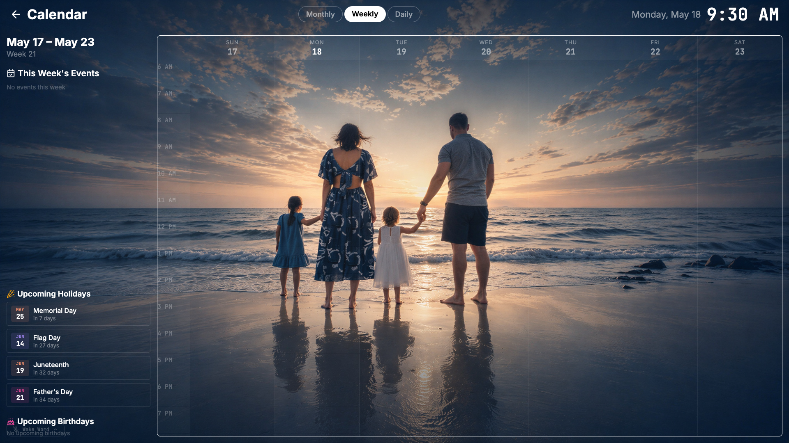
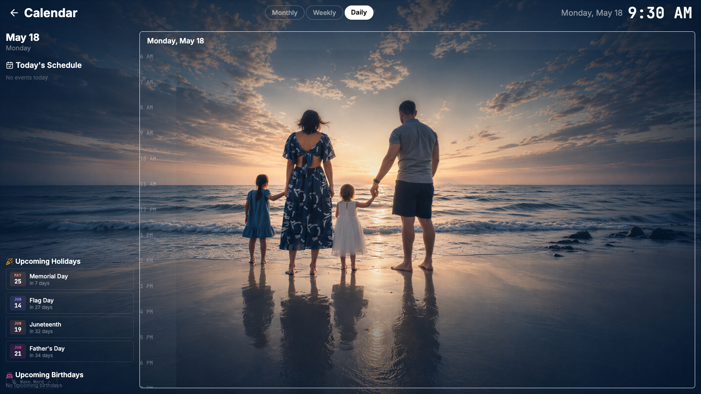
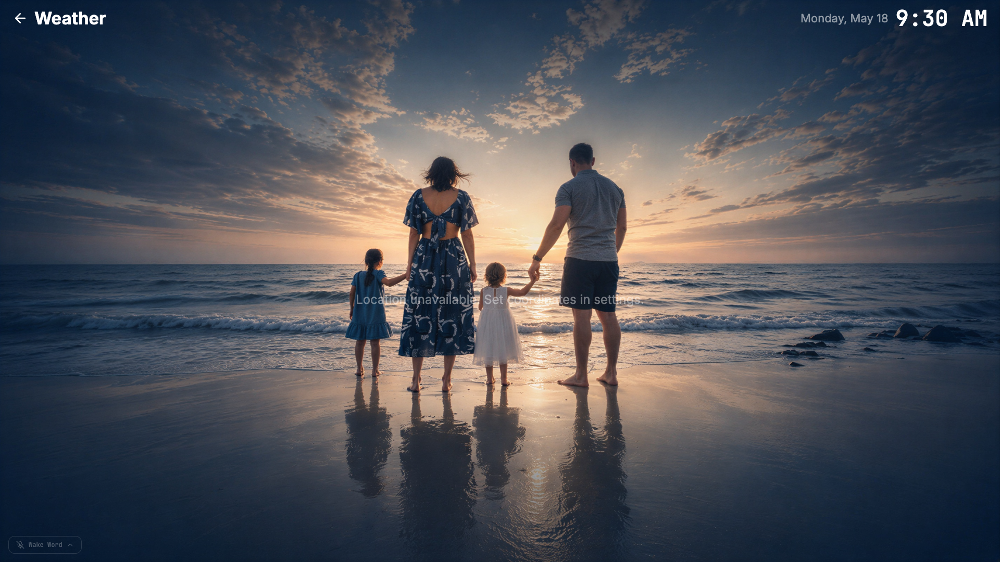
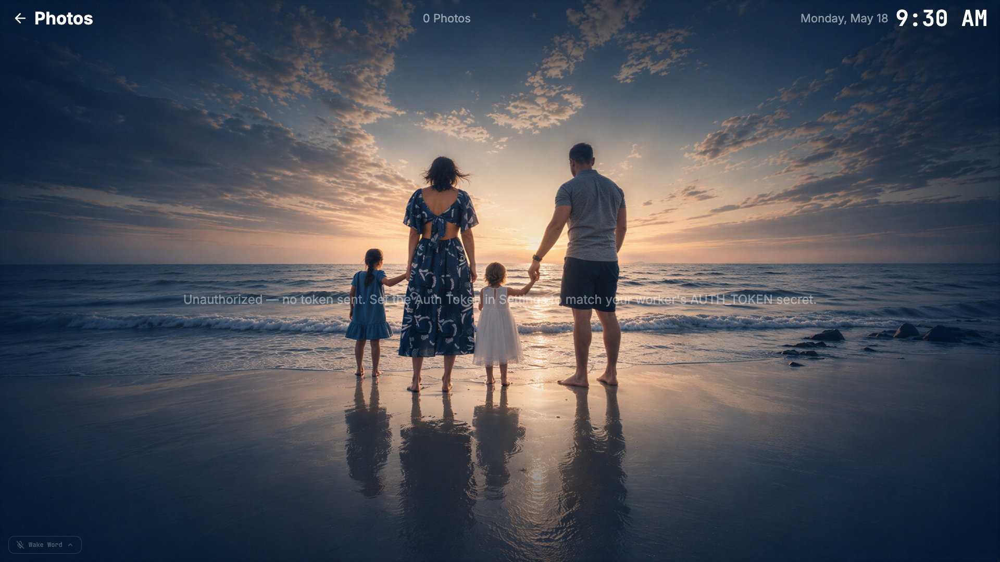
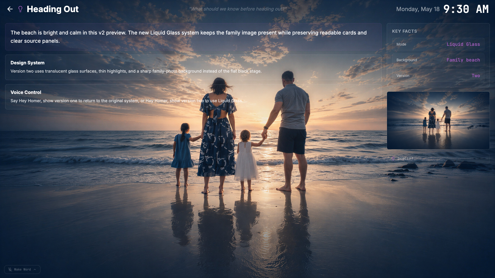
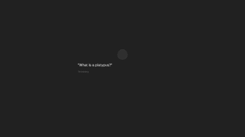

# Home Center

A family TV dashboard running on a Raspberry Pi in Chromium kiosk mode, displayed on a Samsung 4K TV. Built with React + Vite.



## Features

- **Calendar** — daily, weekly, and full-month views with family events
- **Weather** — current conditions and forecast
- **Photos** — family photo slideshow
- **Timers** — voice-activated kitchen/activity timers
- **Notifications** — email triage summaries, school updates
- **Birthdays** — upcoming family birthdays
- **Search / Ask Anything** — LLM-powered Q&A via Cloudflare Worker
- **OpenClaw** — family Telegram assistant (scan QR to open the bot chat)
- **5 themes** — Midnight Observatory, Morning Paper, Retro Terminal, Soft Playroom, Glass Noir

## Pages

| Page | Screenshot |
|------|-----------|
| Full Calendar |  |
| Weekly Calendar |  |
| Daily Calendar |  |
| Weather |  |
| Photos |  |
| LLM Response |  |
| History |  |
| Transcription Overlay |  |

## Architecture

| Machine | Role |
|---------|------|
| **Raspberry Pi** (`homecenter.local`) | Chromium kiosk dashboard + wake word service + HDMI-CEC |
| **Mac Mini** (`macmini.local`) | OpenClaw Telegram bridge, Homer CI, email triage, school updates |
| **Cloudflare Worker** | API proxy, LLM queries, data aggregation |

## Voice Control

The Pi runs a wake word service (`pi/wake_word_service.py`) using openWakeWord + faster-whisper:

- **"Hey Homer"** — turn on TV
- **"Hey Homer, show calendar/weather/photos"** — navigate to page
- **"Hey Homer, set a timer for 5 minutes"** — create a timer
- **"Hey Homer, [question]"** — ask the LLM
- **"Hey Homer, turn off"** — TV standby

## Gesture Control

Meta Ray-Ban glasses stream video to a HandController iOS app, which detects hand gestures and sends them to the Pi. Wave to navigate between panels, pinch to open/close fullscreen pages.

## Contributing

**Before touching state, cards, or data flow:** read the project brain in
[`docs/README.md`](docs/README.md). The four docs there define how state is
derived, what makes a card visible, and which decisions have already been
made. Meaningful changes should update the relevant doc(s) in the same PR.

## Development

```bash
npm install
npm run dev        # http://localhost:5173
npm run build      # outputs to ./dist
npm test           # Vitest suite (architecture invariants)
```

**Display target:** 1920x1080 logical (rendered at 2x on 4K TV via `--force-device-scale-factor=2`).

## Deploying to Pi

```bash
scp pi/wake_word_service.py pi@homecenter.local:/home/pi/home-center/pi/
ssh pi@homecenter.local "sudo systemctl restart wake-word"
```

Dashboard deploys automatically to GitHub Pages from `main` via GitHub Actions.
